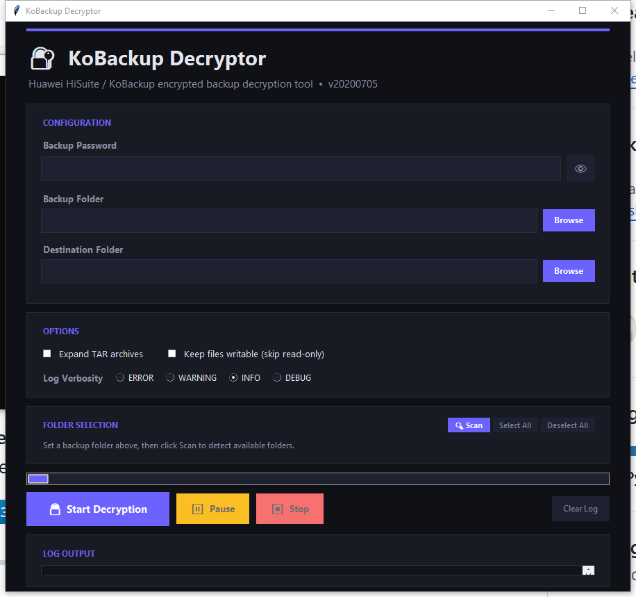

<p align="center">
  <h1 align="center">🔐 KoBackup Decryptor</h1>
  <p align="center">
    <strong>Decrypt Huawei HiSuite &amp; KoBackup encrypted backups</strong><br>
    CLI + Modern GUI &bull; Selective Folder Decryption &bull; Drag & Drop &bull; Password Verification
  </p>
  <p align="center">
    <a href="#-installation"></a>
    <a href="LICENSE"></a>
    <a href="#-changelog"></a>
  </p>
  <p align="center">
    <h3>⬇️ <a href="https://github.com/najeebulhussan/kobackupdec-master/releases/latest">Download the Standalone Windows Executable (.exe)</a> ⬇️</h3>
  </p>
</p>

---

<p align="center">
  
  <br>
  <em>Modern dark-themed GUI with selective folder decryption, pause/stop controls, and real-time log output</em>
</p>

---

## 📖 Overview

**KoBackup Decryptor** (`kobackupdec`) is a Python 3 tool for decrypting Huawei *HiSuite* and *KoBackup* (Android app) encrypted backups. It supports both **v9** and **v10** backup structures.

When decrypting, it automatically:
- Reorganizes the output folder structure to mimic a typical Android filesystem
- Extracts and expands TAR archives (optional)
- Handles large files in chunks for memory efficiency

### ✨ What's New — GUI Edition

This fork adds a **full-featured graphical interface** built with tkinter, bringing the power of `kobackupdec` to users who prefer a visual workflow.

| Feature | CLI | GUI |
|---|:---:|:---:|
| Decrypt full backups | ✅ | ✅ |
| Password verification before decrypt | — | ✅ |
| **Selective folder decryption** | — | ✅ |
| **Drag and Drop support** | — | ✅ |
| **Settings persistence** | — | ✅ |
| Pause / Resume / Stop controls | — | ✅ |
| Export decryption logs | — | ✅ |
| Open Output folder button | — | ✅ |
| Real-time color-coded log output | — | ✅ |
| Progress tracking with status updates | — | ✅ |
| Responsive dark-themed interface | — | ✅ |

---

## 🚀 Installation

### Prerequisites

- **Python 3.7** or later
- **pip** (Python package manager)

### Steps

```bash
# 1. Clone the repository
git clone https://github.com/YOUR_USERNAME/kobackupdec.git
cd kobackupdec

# 2. Install dependencies
pip install -r requirements.txt
```

### 📦 Building a Standalone Executable (.exe)

You can compile the GUI into a portable `.exe` file that requires zero setup (no Python installation needed):

1. Install PyInstaller: `pip install pyinstaller Pillow`
2. Run the build script: `python build.py`
3. The standalone application will be generated at `dist/KoBackupDecryptor.exe`.

### Dependencies

| Package | Purpose |
|---|---|
| `pycryptodome` | AES / PBKDF2 / HMAC cryptographic operations |
| `tkinterdnd2` | Drag and drop functionality for the GUI |
| `tkinter` | GUI framework (bundled with Python on most platforms) |

> **Note:** On some Linux distributions, tkinter may need to be installed separately:
> ```bash
> # Ubuntu / Debian
> sudo apt-get install python3-tk
>
> # Fedora
> sudo dnf install python3-tkinter
> ```

---

## 🖥️ Usage

### GUI Mode (Recommended)

Launch the graphical interface:

```bash
python kobackupdec_gui.py
```

#### GUI Workflow

1. **Enter Password** — Type your backup password (toggle visibility with 👁)
2. **Select Backup Folder** — Drag and drop your Huawei backup directory right into the application, or click **Browse**
3. **Select Destination** — Choose where to save decrypted files (pick a parent, name the output folder)
4. **Configure Options** — Toggle TAR expansion, writable permissions, and log verbosity
5. **Select Folders** — After setting the backup path, check/uncheck individual folders (pictures, video, audios, etc.) to decrypt only what you need
6. **Start Decryption** — Click **🔓 Start Decryption**
7. **Open Output** — When finished, click **📂 Open Output** to view your files immediately

#### GUI Controls

| Button | Function |
|---|---|
| 🔓 **Start Decryption** | Verifies password first, then begins decryption |
| ⏸ **Pause / ▶ Resume** | Temporarily halt and resume the process |
| ⏹ **Stop** | Cancel the decryption (partially decrypted files are kept) |
| 📂 **Open Output** | Opens destination folder in Windows Explorer (enabled after success) |
| **Export Log** | Save decryption logs to a text file for auditing |
| **Select All / Deselect All** | Quickly toggle all folder checkboxes |
| **🔍 Scan** | Re-scan backup directory for available folders |
| **Clear Log** | Clear the log output panel |

#### GUI Features

- **🔑 Password Verification** — Validates the password against `info.xml` before starting decryption. Wrong passwords are caught instantly.
- **📂 Selective Folder Decryption** — Only decrypt what you need (e.g., just pictures and contacts, skip video and apps).
- **💾 Settings Persistence** — The app remembers your selected folders and checkboxes across launches via `config.json`.
- **🖱️ Drag and Drop** — Seamlessly drop backup folders into the app instead of browsing manually.
- **📊 Real-Time Progress & Logs** — Status bar shows current phase. Export logs anytime.
- **🎨 Dark Theme** — Modern, responsive dark interface with color-coded log levels (green=info, yellow=warning, red=error).
- **📐 Responsive Layout** — Resizes gracefully from 600×500 to fullscreen. Folder checkboxes reflow automatically.

---

### CLI Mode

For scripting and automation, the original command-line interface is fully preserved:

```
usage: kobackupdec.py [-h] [-e] [-w] [-v] password backup_path dest_path

Huawei KoBackup decryptor version 20200705

positional arguments:
  password         user password for the backup
  backup_path      backup folder
  dest_path        decrypted backup folder

optional arguments:
  -h, --help       show this help message and exit
  -e, --expandtar  expand tar files
  -w, --writable   do not set RO permission on decrypted data
  -v, --verbose    verbose level, -v to -vvv
```

#### CLI Example

```bash
python kobackupdec.py -vvv 123456 "Z:\HUAWEI P30 Pro_2019-06-28 22.56.31" Z:\HiSuiteBackup
```

<details>
<summary>📋 Click to see example output</summary>

```
INFO:root:getting files and folder from Z:\HUAWEI P30 Pro_2019-06-28 22.56.31
INFO:root:parsing XML files...
INFO:root:parsing xml audio.xml
DEBUG:root:parsing xml file audio.xml
INFO:root:parsing xml document.xml
DEBUG:root:parsing xml file document.xml
INFO:root:parsing xml info.xml
DEBUG:root:ignoring entry HeaderInfo
DEBUG:root:ignoring entry BackupFilePhoneInfo
DEBUG:root:ignoring entry BackupFileVersionInfo
INFO:root:parsing xml picture.xml
DEBUG:root:parsing xml file picture.xml
INFO:root:parsing xml video.xml
DEBUG:root:parsing xml file video.xml
DEBUG:root:crypto_init: using version 3.
DEBUG:root:SHA256(BKEY)[16] = b'8d969eef6ecad3c29a3a629280e686cf'
...
```

</details>

---

## 📁 Output Structure

The decrypted output folder mimics a standard Android filesystem:

```
DecryptedBackup/
├── data/
│   ├── app/                    # APK files
│   │   ├── com.example.app.apk-1/
│   │   └── org.telegram.messenger.apk-1/
│   └── data/                   # App data (TAR contents)
│       ├── com.example.app/
│       └── org.telegram.messenger/
├── db/                         # System databases
│   ├── calendar.db
│   ├── calllog.db
│   ├── contact.db
│   ├── sms.db
│   └── ...
├── storage/                    # Media files
│   ├── DCIM/
│   ├── Download/
│   ├── Pictures/
│   ├── WhatsApp/
│   └── ...
└── unknown/                    # Unrecognized files (copied as-is)
```

---

## 📋 Requirements

| Requirement | Minimum Version |
|---|---|
| Python | 3.7 |
| pycryptodome | Any recent |
| Operating System | Windows, Linux, macOS |

---

## ⚙️ Building Executables

You can compile the scripts into standalone executables using **cx_Freeze**:

```bash
# Build executable
python setup.py build

# Build Windows MSI installer
python setup.py bdist_msi
```

---

## 🗂️ Project Structure

```
kobackupdec/
├── kobackupdec.py          # Core decryption engine (CLI)
├── kobackupdec_gui.py      # GUI application (tkinter)
├── requirements.txt        # Python dependencies
├── setup.py                # cx_Freeze build config
├── LICENSE                 # MIT License
├── README.md               # This file
├── CHANGELOG.md            # Version history
└── .github/
    └── ISSUE_TEMPLATE/     # GitHub issue templates
```

---

## 📝 Changelog

See [CHANGELOG.md](CHANGELOG.md) for the full version history.

### Highlights

- **GUI Edition** — Full graphical interface with selective decryption, pause/stop, and password verification
- **20200705** — Fixed `decrypt_large_package` to read input chunks
- **20200611** — Added `expandtar` and `writable` options
- **20200607** — Merged empty CheckMsg handling
- **2020test** — Rewritten for v9 and v10 backups
- **20190729** — First public release

---

## ❓ FAQ

<details>
<summary><strong>What backup formats are supported?</strong></summary>

Both **v9** and **v10** Huawei KoBackup / HiSuite backup structures. The tool looks for `info.xml` either at the root or inside `backupFiles1/`.
</details>

<details>
<summary><strong>Does it support HiSuite auto-generated passwords?</strong></summary>

No. The tool only supports backups encrypted with a **user-provided password**. HiSuite's self-generated password is not supported.
</details>

<details>
<summary><strong>I get "No module named 'Crypto'" error</strong></summary>

Install `pycryptodome`:
```bash
pip install pycryptodome
```
If you have both `pycrypto` and `pycryptodome`, uninstall the old one first:
```bash
pip uninstall pycrypto
pip install pycryptodome
```
</details>

<details>
<summary><strong>I get "Wrong password" — is my password incorrect?</strong></summary>

The tool validates your password against the backup's `checkMsg` field. If the password is wrong, decryption will not proceed. Double-check the password you used when creating the backup in HiSuite/KoBackup.
</details>

<details>
<summary><strong>Can I decrypt only specific folders (e.g., just photos)?</strong></summary>

**Yes!** In GUI mode, after selecting the backup folder, click **🔍 Scan** to list all available folders. Then uncheck everything you don't need and only the selected folders will be decrypted.
</details>

<details>
<summary><strong>Does the GUI modify the original backup files?</strong></summary>

No. The original backup is only read, never modified. Decrypted files are written to the destination folder you specify.
</details>

---

## 🤝 Contributing

Contributions are welcome! Please:

1. Fork the repository
2. Create a feature branch (`git checkout -b feature/my-feature`)
3. Commit your changes (`git commit -m "Add my feature"`)
4. Push to the branch (`git push origin feature/my-feature`)
5. Open a Pull Request

---

## 📄 License

This project is licensed under the **MIT License** — see the [LICENSE](LICENSE) file for details.

**Original Author:** Francesco "dfirfpi" Picasso, Reality Net System Solutions  
**GUI Extension:** Community contribution

---

## ⚠️ Disclaimer

This tool is intended for **legitimate use only** — decrypting your own backups or backups you are authorized to access. The authors are not responsible for any misuse.
